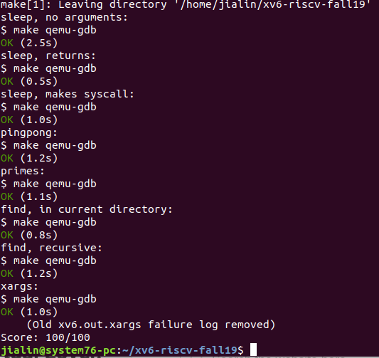

# Lab: Xv6 and Unix utilities
This lab makes you familiar with xv6 and its system calls.
Boot xv6
You must use an x86 Athena machine; that is, uname -a should mention i386 GNU/Linux or i686 GNU/Linux or x86_64 GNU/Linux. You can log into a public Athena host with ssh -X athena.dialup.mit.edu.

We have set up the appropriate compilers and simulators for you on Athena. To use them, run add -f 6.828. You must run this command every time you log in (or add it to your ~/.environment file). If you get obscure errors while compiling or running qemu, double check that you added the course locker.

Fetch the xv6 source for the lab and check out the util branch:

$ git clone git://github.com/mit-pdos/xv6-riscv-fall19.git  
Cloning into 'xv6-riscv'...  
...  
$ cd xv6-riscv-fall19  
$ git checkout util  
The xv6-riscv-fall19 repository differs slightly from the book's xv6-riscv in order to make the labs easier.  

The files you will need for this and subsequent lab assignments in this course are distributed using the Git version control system. Above you created a new branch (git branch util) for your solutions for the utilities lab. To learn more about Git, take a look at the Git user's manual, or, you may find this CS-oriented overview of Git useful. Git allows you to keep track of the changes you make to the code. For example, if you are finished with one of the exercises, and want to checkpoint your progress, you can commit your changes by running:

$ git commit -am 'my solution for util lab exercise 1'  
Created commit 60d2135: my solution for util lab exercise 1  
 1 files changed, 1 insertions(+), 0 deletions(-)  
$  
You can keep track of your changes by using the git diff command. Running git diff will display the changes to your code since your last commit, and git diff origin/xv6-riscv-fall19 will display the changes relative to the initial xv6-riscv-fall19 code. Here, origin/xv6-riscv-fall19 is the name of the git branch with the initial code you downloaded for the class.

# sleep
Implement the UNIX program sleep for xv6; your sleep should pause for a user-specified number of ticks. (A tick is a notion of time defined by the xv6 kernel, namely the time between two interrupts from the timer chip.) Your solution should be in the file user/sleep.c.

# Some hints:

Look at some of the other programs in user/ to see how you can obtain the command-line arguments passed to a program. If the user forgets to pass an argument, sleep should print an error message.
The command-line argument is passed as a string; you can convert it to an integer using atoi (see user/ulib.c).  
Use the system call sleep (see user/usys.S and kernel/sysproc.c).  
Make sure main calls exit() in order to exit your program.  
Add the program to UPROGS in Makefile and compile user programs by typing make fs.img.  
Look at Kernighan and Ritchie's book The C programming language (second edition) (K&R) to learn about C.  
Run the program from the xv6 shell:  

      $ make qemu 
      ... 
      init: starting sh 
      $ sleep 10
      (nothing happens for a little while) 
      $
    
Your solution is correct, if your program behaves as shown above.  

Optional: write an uptime program that prints the uptime in terms of ticks using the uptime system call.  

# pingpong
Write a program that uses UNIX system calls to ``ping-pong'' a byte between two processes over a pair of pipes, one for each direction. The parent sends by writing a byte to parent_fd[1] and the child receives it by reading from parent_fd[0]. After receiving a byte from parent, the child responds with its own byte by writing to child_fd[1], which the parent then reads. Your solution should be in the file user/pingpong.c.

# Some hints:

Use pipe to create a pipe. 
Use fork to create a child.
Use read to read from the pipe, and write to write to the pipe.
Run the program from the xv6 shell and it should produce the following output:

    $ make qemu 
    ... 
    init: starting sh
    $ pingpong
    4: received ping 
    3: received pong
    $ 
  
Your solution is correct, if your program behaves as shown above. The number before ":" is the process id of the process printing the output. You can get the process id by calling the system call getpid.

# primes
Write a concurrent version of prime sieve using pipes. This idea is due to Doug McIlroy, inventor of Unix pipes. The picture halfway down this page and the surrounding text explain how to do it. Your solution should be in the file user/primes.c.

Your goal is to use pipe and fork to set up the pipeline. The first process feeds the numbers 2 through 35 into the pipeline. For each prime number, you will arrange to create one process that reads from its left neighbor over a pipe and writes to its right neighbor over another pipe. Since xv6 has limited number of file descriptors and processes, the first process can stop at 35.

# Some hints:

Be careful to close file descriptors that a process doesn't need, because otherwise your program will run xv6 out of resources before the first process reaches 35.
Once the first process reaches 35, you should arrange that the pipeline terminates cleanly, including all children (Hint: read will return an end-of-file when the write-side of the pipe is closed).
It's simplest to directly write 32-bit ints to the pipes, rather than using formatted ASCII I/O.  
You should create the processes in the pipeline as they are needed.  
Your solution is correct if it produces the following output:  

    $ make qemu  
    ...  
    init: starting sh  
    $ primes  
    prime 2  
    prime 3  
    prime 5  
    prime 7  
    prime 11  
    prime 13  
    prime 17  
    prime 19  
    prime 23  
    prime 29  
    prime 31  
    $  
  
# find
Write a simple version of the UNIX find program: find all the files in a directory tree whose name matches a string. Your solution should be in the file user/find.c.

# Some hints:

Look at user/ls.c to see how to read directories.  
Use recursion to allow find to descend into sub-directories.  
Don't recurse into "." and "..".  
Changes to the file system persist across runs of qemu; to get a clean file system run make clean and then make qemu.  
You'll need to use C strings. Have a look at K&R (the C book), for example Section 5.5.  
Optional: support regular expressions in name matching. grep.c has some primitive support for regular expressions.  

Your solution is correct if produces the following output (when the file system contains a file a/b):  

    $ make qemu  
    ...  
    init: starting sh  
    $ mkdir a  
    $ echo > a/b  
    $ find . b  
    ./a/b  
    $   
  
# xargs
Write a simple version of the UNIX xargs program: read lines from standard input and run a command for each line, supplying the line as arguments to the command. Your solution should be in the file user/xargs.c.  

The following example illustrates xarg's behavior:  
    $ xargs echo bye  
    hello too  
    bye hello too  
    ctrl-d  
    $  
  
Note that the command here is "echo bye" and the additional arguments are "hello too", making the command "echo bye hello too", which outputs "bye hello too".
# Some hints:

Use fork and exec system call to invoke the command on each line of input. Use wait in the parent to wait for the child to complete running the command.
Read from stdin a character at the time until the newline character ('\n').  
kernel/param.h declares MAXARG, which may be useful if you need to declare an argv.  
Changes to the file system persist across runs of qemu; to get a clean file system run make clean and then make qemu.  
xargs, find, and grep combine well:  

  $ find . b | xargs grep hello  
  
will run "grep hello" on each file named b in the directories below ".".  
To test your solution for xargs, run the shell script xargstest.sh. Your solution is correct if it produces the following output:  

  $ make qemu  
  ...  
  init: starting sh  
  $ sh < xargstest.sh  
  $ $ $ $ $ $ hello  
  hello  
  hello  
  $ $     
  
You may have to fix bugs in your find program. The output has many $ because the xv6 shell is primitive and doesn't realize it is processing commands from a file instead of from the console, and prints a $ for each command in the file.  

