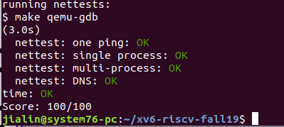

# Lab: networking
In this lab you will write a device driver for a network interface card (NIC) and add support for UDP network sockets to xv6. 

Fetch the xv6 source for the lab and check out the net branch: 

  $ git fetch 
  $ git checkout net 
# Background
Before writing code, you may find it helpful to review "Chapter 4: Traps and device drivers", "Section 7.13: File descriptor layer" from the xv6 book, and the lecture notes on networking. 

We will be using a virtual network device called the E1000 to handle network communication. To xv6 (and the driver you write), the E1000 looks like a real piece of hardware connected to a real Ethernet local area network (LAN). But in reality, the E1000 your driver will talk to is an emulation provided by qemu, connected to a LAN that is also emulated by qemu. On this LAN, xv6 (the "guest") has an IP address of 10.0.2.15. The only other (emulated) computer on the LAN has IP address 10.0.2.2. qemu arranges that when xv6 uses the E1000 to send a packet to 10.0.2.2, it's really delivered to the appropriate application on the (real) computer on which you're running qemu (the "host"). 

We will be using QEMU's user mode network stack since it requires no administrative privileges to run. QEMU's documentation has more about user-net here. We've updated the Makefile to enable QEMU's user-mode network stack and the virtual E1000 network card. 

We also configured QEMU's network stack to record all incoming and outgoing packets to packets.pcap in your lab directory. It may be helpful to review these recordings to confirm that xv6 is sending and receiving the packets you expect. To get a hex/ASCII dump of captured packets use tcpdump like this: 

tcpdump -XXnr packets.pcap 
Finally, we have provided you with all the code you will need to handle parsing and crafting packet headers for ethernet, IP, UDP, and ARP. Make sure to review this code in kernel/net.c and kernel/net.h. A simple abstraction, called an mbuf, is provided to store and manage packet payloads. It will be used throughout this lab assignment. 

# Part 1: Network device driver
In this part of the assignment, you will complete the implementation of the E1000 networking driver. So far, code has been provided to discover and initialize the device, and to handle interrupts, but not to send and receive packets. 

Browse Intel's Software Developer's Manual for the E1000. This manual covers several closely related Ethernet controllers. QEMU emulates the 82540EM. You should skim over chapter 2 now to get a feel for the device. To write your driver, you'll need to be familiar with chapters 3 and 14, as well as 4.1 (though not 4.1's subsections). You'll also need to use chapter 13 as reference. The other chapters mostly cover components of the E1000 that your driver won't have to interact with. Don't worry about the details right now; just get a feel for how the document is structured so you can find things later. Keep in mind that the E1000 has many advanced features, but you can ignore most of these. Only a small set of basic features is needed to complete the lab assignment. 

# Your Job
Your job is to implement support for sending and receiving packets. You'll need to fill in the missing section in e1000_recv() and e1000_transmit(), both in kernel/e1000.c. 

Both sending and receiving packets is managed by a queue of descriptors that is shared between xv6 and the E1000 in memory. These queues provide pointers to memory locations for the E1000 to DMA (i.e. transfer) packet data. They are implemented as circular arrays, meaning that when the card or the driver reach the end of the array, it wraps back around to the beginning. A common abbreviation is to refer to the receive data structures as RX and the transmit data structures as TX. 

The E1000 generates an interrupt whenever new packets are received. Your receive code must scan the RX queue to handle each packet that has arrived and deliver its mbuf to the protocol layer by calling net_rx(). struct rx_desc describes the descriptor format. You will then need to allocate a new mbuf and program it into the descriptor so that the E1000 knows where to place the next payload when it eventually reaches the same location in the array at a later time. 

Packet sends are requested by the protocol layer when it calls e1000_transmit(). Your transmit code must enqueue the mbuf into the TX queue. This includes extracting the payload's location in memory and its length, and encoding this information into a descriptor in the TX queue. struct tx_desc describes the descriptor format. You will need to ensure that mbufs are eventually freed, but only after the transmission has finished (the NIC can encode a notification bit in the descriptor to indicate this). 

In addition to reading and writing to the circular arrays of descriptors, you'll need to interact with the E1000 through memory mapped I/O to detect when new descriptors are available on the receive path and to inform the E1000 that new descriptors have been provided on the transmit path. A pointer to the device's I/O is stored in regs, and it can be accessed as an array of control registers. You'll need to use indices E1000_RDT and E1000_TDT in particular. 

# Hints
Make sure to consider locking. In general, whenever memory is shared, a lock is needed to synchronize access.

# Here are some hints for sending:

For transmitting, first get the current ring position, using E1000_TDT. 
Then check if the the ring is overflowing. If E1000_TXD_STAT_DD is not set in the current descriptor, a previous transmission is still in flight, so return an error. 
Otherwise, use mbuffree() to free the last mbuf that was transmitted with the current descriptor (if there was one). 
Then fill in the descriptor, providing the new mbuf's head pointer and length. Set the necessary cmd flags (read the E1000 manual) and stash away a pointer to the new mbuf for later freeing. 
Finally, update the ring position by adding one to E1000_TDT modulo TX_RING_SIZE. 
If transmit added the mbuf successfully to the ring, return 0 (otherwise the caller will free the mbuf). On failure (e.g., there is no descriptor available to transmit the mbuf), return -1 (so that the caller knows to free the mbuf). 
# Here are some hints for receiving:

First get the next ring position, using E1000_RDT plus one modulo RX_RING_SIZE. 
Then check if a new packet is available by checking for the E1000_RXD_STAT_DD bit in the status portion of the descriptor. If not, stop. 
Otherwise, update the mbuf's length to the length reported in the descriptor (e.g., use mbufput()). Deliver the mbuf to the protocol layer using net_rx().  (e1000_init() allocates an mbuf for each slot in the receive ring initially.) 
Then allocate a new mbuf (because net_rx() maybe hanging on to the mbuf passed to it) and program its head pointer into the descriptor. Clear the descriptor's status bits to zero. 
Finally, update the E1000_RDT register to the next position by writing to it. 
Finally, here are some hints for testing when you're done implementing the missing sections of the E1000 driver. We have provided a tool that can be run by typing make ping in a terminal. Be careful to run it on the same machine that is running an instance your xv6 kernel in QEMU. The ping tool will send one UDP packet to your network stack each second. Add a printf to your e1000_recv() function to verify that you're receiving each UDP ping packet. In particular, check that you can receive more than 16 packets (the size of the descriptor ring). If you run into issues, it may be helpful to inspect packets.pcap to see how it compares to the printouts generated by your driver. 

# Part 2: Network sockets
Now that you have finished the E1000 driver, you will need to support userspace applications. To help with this, a test user program called nettests has been provided, but you will need to implement support for network sockets first so that it can interact with xv6. 

Network sockets are a standard abstraction for OS networking that bear similarity to files. Sockets are accessed through ordinary file descriptors (just like files, pipes, and devices). Reading from a socket file descriptor receives a packet while writing to it sends a packet. If no packets are currently available to be received, the reader must block and wait for the next packet to arrive (i.e. allow rescheduling to another process). In this lab, you will be implementing a stripped down version of sockets that supports the UDP network protocol. 

Each network socket only receives packets for a particular combination of local and remote IP addresses and port numbers, and xv6 is required to support multiple sockets. A socket can be created and bound to the requested addresses and ports via the connect system call, which returns a file descriptor. The implementation of this system call is in kernel/sysfile.c. The code for sockalloc() and related functions is in kernel/sysnet.c. 

Take note of the provided data structures; one struct sock object is created for each socket. sockets is a singly linked list of all active sockets. It is useful for finding which socket to deliver newly received packets to. In addition, each socket object maintains a queue of mbufs waiting to be received. Received packets will stay in these queues until the read() system call dequeues them. 

# Your job
Your job is to implement the missing functionality necessary to support network sockets. This includes adding and integrating functions to support reading, writing, and closing sockets. It also includes completing the implementation of sockrecvudp(), which is called each time a new UDP packet is received. To achieve this, fill in the missing sections in kernel/sysnet.c and modify kernel/file.c to call your socket methods. 

# Hints
Here are some hints: 

Carefully read kernel/pipe.c. It provides an example of implementing one type of file. Sockets are another type of file, and they will require the same file  methods.
Define your socket methods for read, write, and close in kernel/defs.h. Integrate each of these methods into the appropriate call sites in kernel/file.c by checking whether the socket type is FD_SOCK. 
For the read method, check if rxq is empty using mbufq_empty(), and if it is, use sleep() to wait until an mbuf is enqueued. (Don't forget to wrap the sleep() call into a while loop as other usages of sleep() do). Using mbufq_pophead, pop the mbuf from rxq and use copyout() to move its payload into user memory. Free the mbuf using mbuffree() to finish. 
For the write method, allocate a new mbuf, taking care to leave enough headroom for the UDP, IP, and Ethernet headers. Use mbufput() and copyin() to transfer the payload from user memory into the mbuf. Finally, use net_tx_udp() to send the mbuf. 
For the close method, remove the socket from the sockets list. Then, free the socket object. Be careful to free any mbufs that have not been read first, before  freeing the struct sock. 
For sockrecvudp(), identify which socket (if any) can handle the mbuf and deliver it to the appropriate rxq. Use wakeup() to wake any waiting reader. 
Don't forget to consider locking throughout! 
Putting it all together 
When you are finished, run the test program. If everything is correct, you will get the following output: 

(on the host in one terminal) 
$ make server 
python2 server.py 26099 
listening on localhost port 26099 
(then on xv6 in another terminal on the same machine run 
  nettests; see below) 
hello world! 
... 

$ nettests 
testing one ping: OK 
testing single-process pings: OK 
testing multi-process pings: OK 
testing DNS 
DNS arecord for pdos.csail.mit.edu. is [ITS_IP_ADDRESS] 
DNS OK 
all tests passed. 
$ 
If you encounter any issues, try inspecting packets.pcap to see if your E1000 driver is working properly. Adding printfs to e1000_transmit() and e1000_recv() may also help in debugging. 

