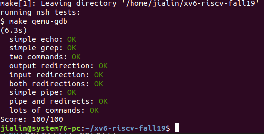

# Lab: Simple xv6 shell
This lab will shed light on how UNIX shells use basic system calls.

Your job is to write a simple shell for xv6. It should be able to run commands with arguments, handle input and output redirection, and set up two-element pipelines. Your shell should act like the xv6 shell sh for these examples as well as similar commands:  

echo hello there  
echo something > file.txt  
ls | grep READ  
grep lion < data.txt | wc > count  
echo echo hello | nsh  
find . b | xargs grep hello  
You should put your shell source in user/nsh.c, and modify the Makefile to compile it. We'll test your user/nsh.c with our copies of other xv6 files; so while you can modify other files, your shell should not depend on those modifications. Your shell should use @ (at sign) as a prompt rather than $, to avoid confusion with the real shell. An xv6 session with your shell might look like this:  

xv6 kernel is booting  
$ nsh  
@ grep Ken < README  
xv6 is a re-implementation of Dennis Ritchie's and Ken Thompson's Unix  
@   
Please do not use a memory allocator such as malloc(). Instead you should use only local (stack-allocated) variables and global variables. It's OK to impose reasonable fixed limits on things like the maximum length of a command name, the maximum number of arguments, or the maximum length of any single argument.

We supply you with an xv6 test program testsh, source in user/testsh.c. You're done with the lab if your shell passes all the tests, like this:  

$ testsh nsh  
simple echo: PASS  
simple grep: PASS  
two commands: PASS  
output redirection: PASS  
input redirection: PASS  
both redirections: PASS  
simple pipe: PASS  
pipe and redirects: PASS  
lots of commands: PASS  
passed all tests  
Getting started  
In this and future labs you will progressively build up your xv6, but it will be handy to maintain a branch per lab:  

  $ git fetch  
  $ git checkout sh  
  
You don't have to merge an earlier lab solution into subsequent labs. If you find you need some work from earlier lab, you are free to merge it into later branches, but most labs are fairly independent of each other.

Git allows switching between existing branches using git checkout branch-name, though you should commit any outstanding changes on one branch before switching to a different one.

# Hints 
You don't need to implement features that aren't required by the tests; for example, you don't have to implement parentheses or quoting.  

The Kernighan and Ritchie C book is full of useful bits of code; feel free to incorporate any of it in your solution (with comments stating where you got the code). For example, you may find useful the gettoken() function from the parser in Section 5.12.  

nsh is much simpler than xv6's sh in terms of features, so you are likely best off writing nsh from scratch. But, you can look at the xv6 shell source (in user/sh.c) for ideas, and borrow code, as long as you include comments saying where you got the code.  

Xv6 supplies you with a small library of C functions in user/ulib.c; feel free to use them. As mentioned above, however, you are not allowed to use malloc().  

Remember to close un-needed file descriptors, both to avoid running out, and because a process reading a pipe won't see end-of-file until all the write descriptors for that pipe are closed.  

Every system call in your code should check whether the call returned an error.  

testsh redirects your shell's standard output, which means you won't see it. Your shell should print error and debug messages to file descriptor 2, the standard error, using fprintf(2,...).  

If testsh complains, it may help to modify testsh to print the command it wants your shell to run, and to modify your shell to print the command-line(s) it receives and the commands it executes.  

Another helpful trick is to modify one() in testsh.c to print the output it read from your shell, and the output it expected.  

