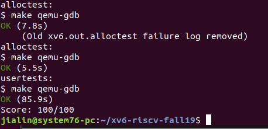

# Lab: Allocator for xv6
For this lab we have replaced the page allocator in the xv6 kernel with a buddy allocator. You will modify xv6 to use this allocator to allocate and free file structs so that xv6 can have more open file descriptors than the existing system-wide limit NFILE. Furthermore, you will implement an optimization that reduces the buddy's use of memory. You are done if your modified kernel passes both alloctest and usertests.
To start the lab, switch to the alloc branch:  

  $ git fetch  
  $ git checkout alloc  
The only files you should change in this lab are kernel/buddy.c and kernel/file.c.  

# The problem
xv6 has only a page allocator and cannot dynamically allocate objects smaller than a page. To work around this limitation, xv6 declares objects smaller than a page statically. For example, xv6 declares an array of file structs, an array of proc structures, and so on. As a result, the number of files the system can have open is limited by the size of the statically declared file array, which has NFILE entries (see kernel/file.c and kernel/param.h).

# The solution
The solution is to adopt the buddy allocator from the allocator lecture, which we have added to xv6 in kernel/buddy.c and kernel/list.c.  

# Your job 
Your job is to further improve xv6's memory allocation in two ways:  

Modify kernel/file.c to use the buddy allocator so that the number of file structures is limited by memory rather than NFILE.
The buddy allocator is space inefficient. The alloc array has a bit for each block for each size. There is a clever optimization that reduces the cost to only one bit for each pair of blocks. This single bit is B1_is_free XOR B2_is_free, for a buddy pair of blocks B1 and B2. Each time a block is allocated or freed, you flip the bit to reflect the change. For example, if B1 and B2 are allocated, the bit will be zero and if B1 is freed the bit changes to 1. If the bit is 1 and B2 is freed, then we know that B1 and B2 should be merged. Saving 1/2 bit per block matters when xv6 uses the buddy allocator for the roughly 128 Mbyte of free memory that xv6 must manage: this optimization saves about 1 MByte of memory.
The alloctest program
To help you test your implementation, we've provided an xv6 program called alloctest (source in user/alloctest.c). It has two tests.  

The first test allocates more than NFILE file structures by creating many processes, each opening many file descriptors. The first test will fail on unmodified xv6.  

The second test creates a process that allocates as much memory as possible, and fails if less than a certain amount is available. It's effectively a test to see how much memory the kernel is using. The test will fail with the unoptimized buddy allocator that we have given you.  

When you are done, your kernel should be able to run both alloctest and usertests. That is:  

$ alloctest  
filetest: start  
filetest: OK  
memtest: start  
memtest: OK  
$ usertests  
...  
ALL TESTS PASSED  
$  
# Hints
You'll want to remove line 19 in kernel/file.c, which declares file[NFILE]. Instead, allocate struct file in filealloc using bd_malloc. In fileclose you will free the allocated memory. Note that you can simplify fileclose, because ff isn't needed.
fileclose still needs to acquire ftable.lock because the lock protects f->ref.
bd_malloc doesn't clear the memory it returns; instead, allocated memory starts out with whatever content it had from its last use. Callers should not assume that it starts out containing zeroes.
You can use bd_print to print the state of the allocator.
Compared to the lecture notes, we have modified bd_init so that it is called with the range of physical memory available for allocation. bd_init allocates memory for the buddy data structures from that memory. It initializes its data structures accordingly: bd_init marks memory that is used for buddy data structures as allocated so that it won't be re-allocated. Furthermore, we have modified bd_init to handle an amount of memory that isn't a power of 2 by marking unavailable memory as allocated. Finally, we modified the buddy allocator to serialize concurrent calls to it using a lock.  

