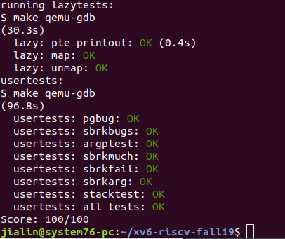

# Lab: xv6 lazy page allocation
One of the many neat tricks an O/S can play with page table hardware is lazy allocation of user-space heap memory. Xv6 applications ask the kernel for heap memory using the sbrk() system call. In the kernel we've given you, sbrk() allocates physical memory and maps it into the process's virtual address space. However, there are programs that use sbrk() to ask for large amounts of memory but never use most of it, for example to implement large sparse arrays. To optimize for this case, sophisticated kernels allocate user memory lazily. That is, sbrk() doesn't allocate physical memory, but just remembers which addresses are allocated. When the process first tries to use any given page of memory, the CPU generates a page fault, which the kernel handles by allocating physical memory, zeroing it, and mapping it. You'll add this lazy allocation feature to xv6 in this lab.

Before writing code, you should make sure you have read "Chapter 3: Page Tables" from the xv6 book and studied the corresponding code.  

$ git fetch  
$ git checkout lazy  
  
Print page table
It's often worthwhile to invest time writing code that helps debugging, so your first task is to implement a function that prints the contents of a page table. Define the function in kernel/vm.c; it has the following prototype: void vmprint(pagetable_t). This function will be handy for debugging and will make you familiar with RISC-V page tables. Insert a call to vmprint in exec.c to print the page table for the first user process; its output should be as below.
The output of vmprint for the first user-level process should be as follows:  

page table 0x0000000087f6e000  
 ..0: pte 0x0000000021fda801 pa 0x0000000087f6a000  
 .. ..0: pte 0x0000000021fda401 pa 0x0000000087f69000  
 .. .. ..0: pte 0x0000000021fdac1f pa 0x0000000087f6b000  
 .. .. ..1: pte 0x0000000021fda00f pa 0x0000000087f68000  
 .. .. ..2: pte 0x0000000021fd9c1f pa 0x0000000087f67000  
 ..255: pte 0x0000000021fdb401 pa 0x0000000087f6d000  
 .. ..511: pte 0x0000000021fdb001 pa 0x0000000087f6c000  
 .. .. ..510: pte 0x0000000021fdd807 pa 0x0000000087f76000  
 .. .. ..511: pte 0x000000002000200b pa 0x0000000080008000  
  
The first line prints the address of the argument of vmprint. Each PTE line shows the PTE index in its page directory, the pte, the physical address for the PTE. The output should also indicate the level of the page directory: the top-level entries are preceeded by "..", the next level down with another "..", and so on. You should not print entries that are not mapped. In the above example, the top-level page directory has mappings for entry 0 and 255. The next level down for entry 0 has only index 0 mapped, and the bottom-level for that index 0 has entries 0, 1, and 2 mapped. 

#Some hints:
Use the macros at the end of the file kernel/riscv.h.
The function freewalk may be inspirational.
Define the prototype for vmprint in kernel/defs.h so that you can call it from exec.c.
Eliminate allocation from sbrk()
Your first task is to delete page allocation from the sbrk(n) system call implementation, which is the function sys_sbrk() in sysproc.c. The sbrk(n) system call grows the process's memory size by n bytes, and then returns the start of the newly allocated region (i.e., the old size). Your new sbrk(n) should just increment the process's size (myproc()->sz) by n and return the old size. It should not allocate memory -- so you should delete the call to growproc() (but you still need to increase the process's size!).
Try to guess what the result of this modification will be: what will break?

Make this modification, boot xv6, and type echo hi to the shell. You should see something like this:

init: starting sh
$ echo hiusertrap(): unexpected scause 0x000000000000000f pid=3  
            sepc=0x0000000000001258 stval=0x0000000000004008  
va=0x0000000000004000 pte=0x0000000000000000  
panic: uvmunmap: not mapped
The "usertrap(): ..." message is from the user trap handler in trap.c; it has caught an exception that it does not know how to handle. Make sure you understand why this page fault occurs. The "stval=0x0..04008" indicates that the virtual address that caused the page fault is 0x4008.
Lazy allocation
Modify the code in trap.c to respond to a page fault from user space by mapping a newly-allocated page of physical memory at the faulting address, and then returning back to user space to let the process continue executing. You should add your code just before the printf call that produced the "usertrap(): ..." message. Your solution is acceptable if it passes usertests.
A good way to start this lab is by fixing usertrap() in trap.c so that you can run "echo hi" in the shell again. Once that works, you will find some additional problems that have to be solved to make usertests to work correctly. Here are some hints to get going.

You can check whether a fault is a page fault by seeing if r_scause() is 13 or 15 in usertrap().
Look at the arguments to the printf() in usertrap() that reports the page fault, in order to see how to find the virtual address that caused the page fault.
Steal code from uvmalloc() in vm.c, which is what sbrk() calls (via growproc()). You'll need to call kalloc() and mappages().
Use PGROUNDDOWN(va) to round the faulting virtual address down to a page boundary.
uvmunmap() will panic; modify it to not panic if some pages aren't mapped.
If the kernel crashes, look up sepc in kernel/kernel.asm
Use your print function from above to print the content of a page table.
If you see the error "incomplete type proc", include "proc.h" (and "spinlock.h").
If all goes well, your lazy allocation code should result in echo hi working. You should get at least one page fault (and thus lazy allocation) in the shell, and perhaps two.

Usertests
Now you have the basics working, fix your code so that all of usertests passes:

Handle negative sbrk() arguments.
Kill a process if it page-faults on a virtual memory address higher than any allocated with sbrk().
Handle fork() correctly.
Handle the case in which a process passes a valid address from sbrk() to a system call such as read or write, but the memory for that address has not yet been allocated.
Handle out-of-memory correctly: if kalloc() fails in the page fault handler, kill the current process.
Handle faults on the invalid page below the stack.
Your solution is acceptable if your kernel passes lazytests and usertests:  

$  lazytests  
lazytests starting  
running test lazy alloc  
test lazy alloc: OK  
running test lazy unmap...  
usertrap(): ...  
test lazy unmap: OK  
running test out of memory  
usertrap(): ...  
test out of memory: OK  
ALL TESTS PASSED  
$ usertests  
...  
ALL TESTS PASSED  
$  

