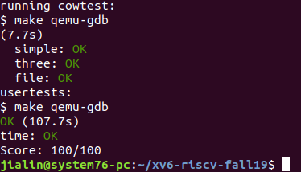

# Lab: Copy-on-Write Fork for xv6
Your task is to implement copy-on-write fork in the xv6 kernel. You are done if your modified kernel executes both the cowtest and usertests programs successfully.

# The problem
The fork() system call in xv6 copies all of the parent process's user-space memory into the child. If the parent is large, copying can take a long time. In addition, the copies often waste memory; in many cases neither the parent nor the child modifies a page, so that in principle they could share the same physical memory. The inefficiency is particularly clear if the child calls exec(), since exec() will throw away the copied pages, probably without using most of them. On the other hand, if both parent and child use a page, and one or both writes it, a copy is truly needed.

# The solution
The goal of copy-on-write (COW) fork() is to defer allocating and copying physical memory pages for the child until the copies are actually needed, if ever.
COW fork() creates just a pagetable for the child, with PTEs for user memory pointing to the parent's physical pages. COW fork() marks all the user PTEs in both parent and child as not writable. When either process tries to write one of these COW pages, the CPU will force a page fault. The kernel page-fault handler detects this case, allocates a page of physical memory for the faulting process, copies the original page into the new page, and modifies the relevant PTE in the faulting process to refer to the new page, this time with the PTE marked writeable. When the page fault handler returns, the user process will be able to write its copy of the page.

COW fork() makes freeing of the physical pages that implement user memory a little trickier. A given physical page may be referred to by multiple processes' page tables, and should be freed only when the last reference disappears.

The cowtest program
To help you test your implementation, we've provided an xv6 program called cowtest (source in user/cowtest.c). cowtest runs various tests, but even the first will fail on unmodified xv6. Thus, initially, you will see:
$ cowtest 
simple: fork() failed 
$  
The "simple" test allocates more than half of available physical memory, and then fork()s. The fork fails because there is not enough free physical memory to give the child a complete copy of the parent.
When you are done, your kernel should be able to run both cowtest and usertests. That is:

$ cowtest
simple: ok
simple: ok
three: zombie!
ok
three: zombie!
ok
three: zombie!
ok
file: ok
ALL COW TESTS PASSED
$ usertests
...
ALL TESTS PASSED
$

# Hints
The lazy page allocation lab has likely made you familiar with much of the xv6 kernel code that's relevant for copy-on-write. However, you should not base this lab on your lazy allocation solution; instead, please start with a fresh copy of xv6 as directed above.
Here's one reasonable plan of attack. Modify uvmcopy() to map the parent's physical pages into the child, instead of allocating new pages, and clear PTE_W in the PTEs of both child and parent. Modify usertrap() to recognize page faults. When a page-fault occurs on a COW page, allocate a new page with kalloc(), copy the old page to the new page, and install the new page in the PTE with PTE_W set. Next, ensure that each physical page is freed when the last PTE reference to it goes away (but not before!), perhaps by implementing reference counts in kalloc.c. Finally, modify copyout() to use the same scheme as page faults when it encounters a COW page.

It may be useful to have a way to record, for each PTE, whether it is a COW mapping. You can use the RSW (reserved for software) bits in the RISC-V PTE for this.

usertests explores more situations than cowtest, so don't forget to check that all tests pass for both.

Some helpful macros and definitions for page table flags are at the end of the file kernel/riscv.h.

