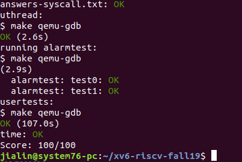

Lab: user-level threads and alarm
This lab will familiarize you with how state is saved and restored in context switches and system calls. You will implement switching between threads in a user-level threads package, and implement an "alarm" feature that delivers interrupt-like events to programs.

Before writing code, you should make sure you have read "Chapter 4: Traps and device drivers" and "Chapter 6: Scheduling" from the xv6 book and studied the corresponding code.

  $ git fetch
  $ git checkout syscall
  
Warmup: RISC-V assembly
For this lab it will be important to understand a bit of RISC-V assembly. There is a file user/call.c in your xv6 repo. make fs.img builds a user program call and a readable assembly version of the program in user/call.asm.

Read the code in call.asm for the functions g, f, and main. The instruction manual for RISC-V is in the doc directory (doc/riscv-spec-v2.2.pdf). Here are some questions that you should answer (store the answers in a file answers-syscall.txt):

Which registers contain arguments to functions? For example, which register holds 13 in main's call to printf?
Where is the function call to f from main? Where is the call to g? (Hint: the compiler may inline functions.)
At what address is the function printf located?
What value is in the register ra just after the jalr to printf in main?
Uthread: switching between threads
In this exercise you will design the context switch mechanism for a user-level threading system, and then implement it. To get you started, your xv6 has two files user/uthread.c and user/uthread_switch.S, and a rule in the Makefile to build a uthread program. uthread.c contains most of a user-level threading package, and code for three simple test threads. The threading package is missing some of the code to create a thread and to switch between threads.

Your job is to come up with a plan to create threads and save/restore registers to switch between threads, and implement that plan.

Once you've finished, you should see the following output when you run uthread on xv6 (the three threads might start in a different order):
~/classes/6828/xv6$ make qemu
...
$ uthread
thread_a started
thread_b started
thread_c started
thread_c 0
thread_a 0
thread_b 0
thread_c 1
thread_a 1
thread_b 1
...
thread_c 99
thread_a 99
thread_b 99
thread_c: exit after 100
thread_a: exit after 100
thread_b: exit after 100
thread_schedule: no runnable threads
$
This output comes from the three test threads, each of which has a loop that prints a line and then yields the CPU to the other threads.

At this point, however, with no context switch code, you'll see no output.

You should complete thread_create to create a properly initialized thread so that when the scheduler switches to that thread for the first time, thread_switch returns to the function passed as argument func, running on the thread's stack. You will have to decide where to save/restore registers. Several solutions are possible. You are allowed to modify struct thread. You'll need to add a call to thread_switch in thread_schedule; you can pass whatever arguments you need to thread_switch, but the intent is to switch from thread t to the next_thread.

Some hints:

thread_switch needs to save/restore only the callee-save registers. Why?
You can add fields to struct thread into which to save registers.
You can see the assembly code for uthread in user/uthread.asm, which may be handy for debugging.
To test your code it might be helpful to single step through your thread_switch using riscv64-linux-gnu-gdb. You can get started in this way:
(gdb) file user/_uthread
Reading symbols from user/_uthread...
(gdb) b thread.c:60

This sets a breakpoint at a specified line in thread.c. The breakpoint may (or may not) be triggered before you even run uthread. How could that happen?

Once your xv6 shell runs, type "uthread", and gdb will break at line thread_switch. Now you can type commands like the following to inspect the state of uthread:

  (gdb) p/x *next_thread
With "x", you can examine the content of a memory location:
  (gdb) x/x next_thread->stack
You can single step assembly instructions using:

   (gdb) si  
On-line documentation for gdb is here.

Alarm
In this exercise you'll add a feature to xv6 that periodically alerts a process as it uses CPU time. This might be useful for compute-bound processes that want to limit how much CPU time they chew up, or for processes that want to compute but also want to take some periodic action. More generally, you'll be implementing a primitive form of user-level interrupt/fault handlers; you could use something similar to handle page faults in the application, for example. Your solution is correct if it passes alarmtest and usertests.

You should add a new sigalarm(interval, handler) system call. If an application calls sigalarm(n, fn), then after every n "ticks" of CPU time that the program consumes, the kernel should cause application function fn to be called. When fn returns, the application should resume where it left off. A tick is a fairly arbitrary unit of time in xv6, determined by how often a hardware timer generates interrupts.

You'll find a file user/alarmtest.c in your xv6 repository. Add it to the Makefile. It won't compile correctly until you've added sigalarm and sigreturn system calls (see below).

alarmtest calls sigalarm(2, periodic) in test0 to ask the kernel to force a call to periodic() every 2 ticks, and then spins for a while. You can see the assembly code for alarmtest in user/alarmtest.asm, which may be handy for debugging. Your solution is correct when alarmtest produces output like this and usertests also runs correctly:

$ alarmtest
test0 start
......................................alarm!
test0 passed
test1 start
..alarm!
..alarm!
..alarm!
.alarm!
..alarm!
..alarm!
..alarm!
..alarm!
..alarm!
..alarm!
test1 passed
$ usertests
...
ALL TESTS PASSED
$
The first challenge is to arrange that the handler is invoked when the process's alarm interval expires. You'll need to modify usertrap() in kernel/trap.c so that when a process's alarm interval expires, the process executes the handler. How can you do that? You will need to understand how system calls work (i.e., the code in kernel/trampoline.S and kernel/trap.c). Which register contains the user-space instruction address to which system calls return?

Your solution will be only a few lines of code, but it may be tricky to get it right. We'll test your code with the version of alarmtest.c in the original repository; if you modify alarmtest.c, make sure your kernel changes cause the original alarmtest to pass the tests.

test0: invoke handler
Get started by modifying the kernel to jump to the alarm handler in user space, which will cause test0 to print "alarm!". Don't worry yet what happens after the "alarm!" output; it's OK for now if your program crashes after printing "alarm!". Here are some hints:

You'll need to modify the Makefile to cause alarmtest.c to be compiled as an xv6 user program.
The right declarations to put in user/user.h are:
    int sigalarm(int ticks, void (*handler)());
    int sigreturn(void);
Update user/usys.pl (which generates user/usys.S), kernel/syscall.h, and kernel/syscall.c to allow alarmtest to invoke the sigalarm and sigreturn system calls.
For now, your sys_sigreturn should just return zero.
Your sys_sigalarm() should store the alarm interval and the pointer to the handler function in new fields in the proc structure (in kernel/proc.h).
You'll need to keep track of how many ticks have passed since the last call (or are left until the next call) to a process's alarm handler; you'll need a new field in struct proc for this too. You can initialize proc fields in allocproc() in proc.c.
Every tick, the hardware clock forces an interrupt, which is handled in usertrap(); you should add some code here.
You only want to manipulate a process's alarm ticks if there's a timer interrupt; you want something like
    if(which_dev == 2) ...
Only invoke the alarm function if the process has a timer outstanding. Note that the address of the user's alarm function might be 0 (e.g., in alarmtest.asm, periodic is at address 0).
It will be easier to look at traps with gdb if you tell qemu to use only one CPU, which you can do by running
    make CPUS=1 qemu-gdb
You've succeeded if alarmtest prints "alarm!".
test1(): resume interrupted code
Chances are that alarmtest crashes in test0 or test1 after it prints "alarm!", or that alarmtest (eventually) prints "test1 failed", or that alarmtest exits without printing "test1 passed". To fix this, you must ensure that, when the alarm handler is done, control returns to the instruction at which the user program was originally interrupted by the timer interrupt. You must ensure that the register contents are restored to the values they held at the time of the interrupt, so that the user program can continue undisturbed after the alarm. Finally, you should "re-arm" the alarm counter after each time it goes off, so that the handler is called periodically.
As a starting point, we've made a design decision for you: user alarm handlers are required to call the sigreturn system call when they have finished. Have a look at periodic in alarmtest.c for an example. This means that you can add code to usertrap and sys_sigreturn that cooperate to cause the user process to resume properly after it has handled the alarm.

Some hints:

Your solution will require you to save and restore registers---what registers do you need to save and restore to resume the interrupted code correctly? (Hint: it will be many).
Have usertrap save enough state in struct proc when the timer goes off that sigreturn can correctly return to the interrupted user code.
Prevent re-entrant calls to the handler----if a handler hasn't returned yet, the kernel shouldn't call it again.
Once you pass test0 and test1, run usertests to make sure you didn't break any other parts of the kernel.

This completes the lab. Make sure you pass all of the make grade tests and don't forget to write up your answers to the questions in answers-syscall.txt. Commit your changes (including adding answers-syscall.txt) and type make handin in the lab directory to hand in your lab.

