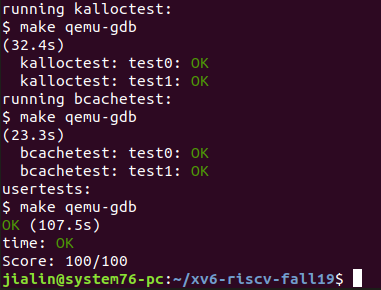

# Lab: locks
In this lab you'll gain experience in re-designing code to increase parallelism. A common symptom of poor parallelism on multi-core machines is high lock contention. Improving parallelism often involves changing both data structures and locking strategies in order to reduce contention. You'll do this for the xv6 memory allocator and block cache.

Before writing code, you should make sure you have read "Chapter 4: Locking" from the xv6 book and studied the corresponding code.

  $ git fetch
  $ git checkout lock
Memory allocator
The program user/kalloctest stresses xv6's memory allocator: three processes grow and shrink their address spaces, resulting in many calls to kalloc and kfree. kalloc and kfree obtain kmem.lock. kalloctest prints the number of test-and-sets that did not succeed in acquiring the kmem lock (and some other locks), which is a rough measure of contention:

$ kalloctest
start test0
test0 results:
=== lock kmem/bcache stats
lock: kmem: #test-and-set 161724 #acquire() 433008
lock: bcache: #test-and-set 0 #acquire() 812
=== top 5 contended locks:
lock: kmem: #test-and-set 161724 #acquire() 433008
lock: proc: #test-and-set 290 #acquire() 961
lock: proc: #test-and-set 240 #acquire() 962
lock: proc: #test-and-set 72 #acquire() 907
lock: proc: #test-and-set 68 #acquire() 907
test0 FAIL
start test1
total allocated number of pages: 200000 (out of 32768)
test1 OK
acquire maintains, for each lock, the count of calls to acquire for that lock, and the count of test-and-sets that didn't manage to acquire the lock. kalloctest calls a system call that causes the kernel to print those counts for the kmem and bcache locks (which are the focus of this lab) and for the 5 most contended locks. If there is lock contention the number of test-and-sets will be high because it takes many loop iterations before acquire obtains the lock. The system call returns the sum of the #test-and-sets for the kmem and bcache locks.

For this lab, you must use a dedicated unloaded machine with multiple cores. If you use a machine that is doing other things, the test-and-set counts that kalloctest prints will be nonsense. You can use a dedicated Athena workstation, or your own laptop, but don't use a dialup machine.

The root cause of lock contention in kalloctest is that kalloc() has a single free list, protected by a single lock. To remove lock contention, you will have to redesign the memory allocator to avoid a single lock and list. The basic idea is to maintain a free list per CPU, each list with its own lock. Allocations and frees on different CPUs can run in parallel, because each CPU will operate on a different list. The main challenge will be to deal with the case in which one CPU's free list is empty, but another CPU's list has free memory; in that case, the one CPU must "steal" part of the other CPU's free list. Stealing may introduce lock contention, but that will hopefully be infrequent.

Your job is to implement per-CPU freelists and stealing when one CPU's list is empty. Run kalloctest to see if your implementation has reduced lock contention, and to check that it can still allocate all of memory. Your output will look similar to that shown below, although the specific numbers will differ. Make sure usertests still passes.

$ kalloctest
start test0
test0 results:
=== lock kmem/bcache stats
lock: kmem: #test-and-set 0 #acquire() 33167
lock: kmem: #test-and-set 0 #acquire() 200114
lock: kmem: #test-and-set 0 #acquire() 199752
lock: bcache: #test-and-set 0 #acquire() 28
=== top 5 contended locks:
lock: proc: #test-and-set 22303 #acquire() 180082
lock: proc: #test-and-set 4162 #acquire() 180130
lock: proc: #test-and-set 4115 #acquire() 180129
lock: proc: #test-and-set 342 #acquire() 180070
lock: proc: #test-and-set 39 #acquire() 180070
test0 OK
start test1
total allocated number of pages: 200000 (out of 32768)
test1 OK
$
$ usertests
...
ALL TESTS PASSED
$
Please give all of your locks initlock names that start with "kmem".

Some hints:

You can use the constant NCPU from kernel/param.h
Let freerange give all free memory to the CPU running freerange.
The function cpuid returns the current core number, but it's only safe to call it and use its result when interrupts are turned off. You should use push_off() and pop_off() to turn interrupts off and on.
Buffer cache
If multiple processes use the file system intensively, they will likely contend for bcache.lock, which protects the disk block cache in kernel/bio.c. bcachetest creates several processes that repeatedly read different files in order to generate contention on bcache.lock; its output looks like this (before you complete this lab):

$ bcachetest
start test0
test0 results:
=== lock kmem/bcache stats
lock: kmem: #test-and-set 0 #acquire() 33026
lock: kmem: #test-and-set 0 #acquire() 50
lock: kmem: #test-and-set 0 #acquire() 73
lock: bcache: #test-and-set 186438 #acquire() 65650
=== top 5 contended locks:
lock: bcache: #test-and-set 186438 #acquire() 65650
lock: proc: #test-and-set 52912 #acquire() 66921
lock: proc: #test-and-set 14693 #acquire() 66568
lock: proc: #test-and-set 13379 #acquire() 66568
lock: proc: #test-and-set 12117 #acquire() 66568
test0: FAIL
start test1
test1 OK
You will likely see different output, but the number of test-and-sets for the bcache lock will be high. If you look at the code in kernel/bio.c, you'll see that bcache.lock protects the list of cached block buffers, the reference count (b->refcnt) in each block buffer, and the identities of the cached blocks (b->dev and b->blockno).
Modify the block cache so that the number of test-and-sets for all locks in the bcache is close to zero when running bcachetest. Ideally the sum of test-and-sets of all locks involved in the block cache should be zero, but it's OK if the sum is less than 500. Modify bget and brelse so that concurrent lookups and releases for different blocks that are in the bcache are unlikely to conflict on locks (e.g., don't all have to wait for bcache.lock). You must maintain the invariant that at most one copy of a block is cached. When you are done, your output should be similar to that shown below (though not identical). Make sure usertests still passes.

$ bcachetest
start test0
test0 results:
=== lock kmem/bcache stats
lock: kmem: #test-and-set 0 #acquire() 32968
lock: kmem: #test-and-set 0 #acquire() 53
lock: kmem: #test-and-set 0 #acquire() 53
lock: bcache: #test-and-set 0 #acquire() 598
lock: bcache.bucket: #test-and-set 0 #acquire() 4139
lock: bcache.bucket: #test-and-set 0 #acquire() 4131
lock: bcache.bucket: #test-and-set 0 #acquire() 2360
lock: bcache.bucket: #test-and-set 0 #acquire() 4307
lock: bcache.bucket: #test-and-set 0 #acquire() 2419
lock: bcache.bucket: #test-and-set 0 #acquire() 4420
lock: bcache.bucket: #test-and-set 0 #acquire() 4934
lock: bcache.bucket: #test-and-set 18 #acquire() 8692
lock: bcache.bucket: #test-and-set 0 #acquire() 6457
lock: bcache.bucket: #test-and-set 0 #acquire() 6197
lock: bcache.bucket: #test-and-set 0 #acquire() 6191
lock: bcache.bucket: #test-and-set 0 #acquire() 6210
lock: bcache.bucket: #test-and-set 0 #acquire() 6198
=== top 5 contended locks:
lock: proc: #test-and-set 1113301 #acquire() 68753
lock: proc: #test-and-set 845107 #acquire() 68685
lock: proc: #test-and-set 822143 #acquire() 68685
lock: proc: #test-and-set 808826 #acquire() 68685
lock: proc: #test-and-set 664514 #acquire() 68727
test0: OK
start test1
test1 OK
$ usertests
  ...
ALL TESTS PASSED
$
Please give all of your locks names that start with "bcache". That is, you should call initlock for each of your locks, and pass a name that starts with "bcache".

Reducing contention in the block cache is more tricky than for kalloc, because bcache buffers are truly shared among processes (and thus CPUs). For kalloc, one could eliminate most contention by giving each CPU its own allocator; that won't work for the block cache. We suggest you look up block numbers in the cache with a hash table that has a lock per hash bucket.

There are some circumstances in which it's OK if your solution has lock conflicts:

When two processes concurrently use the same block number. bcachetest test0 doesn't ever do this.
When two processes concurrently miss in the cache, and need to find an unused block to replace. bcachetest test0 doesn't ever do this.
When two processes concurrently use blocks that conflict in whatever scheme you use to partition the blocks and locks; for example, if two processes use blocks whose block numbers hash to the same slot in a hash table. bcachetest test0 might do this, depending on your design, but you should try to adjust your scheme's details to avoid conflicts (e.g., change the size of your hash table).
bcachetest's test1 uses more distinct blocks than there are buffers, and exercises lots of file system code paths.

Here are some hints:

Read the description of the block cache in the xv6 book (Section 7.2).
It is OK to use a fixed number of buckets and not resize the hash table dynamically. Use a prime number of buckets (e.g., 13) to reduce the likelihood of hashing conflicts.
Searching in the hash table for a buffer and allocating an entry for that buffer when the buffer is not found must be atomic.
Remove the list of all buffers (bcache.head etc.) and instead time-stamp buffers using the time of their last use (i.e., using ticks in kernel/trap.c). With this change brelse doesn't need to acquire the bcache lock, and bget can select the least-recently used block based on the time-stamps.
It is OK to serialize eviction in bget (i.e., the part of bget that selects a buffer to re-use when a lookup misses in the cache).
Your solution might need to hold two locks in some cases; for example, during eviction you may need to hold the bcache lock and a lock per bucket. Make sure you avoid deadlock.
When replacing a block, you might move a struct buf from one bucket to another bucket, because the new block hashes to a different bucket. You might have a tricky case: the new block might hash to the same bucket as the old block. Make sure you avoid deadlock in that case. 

