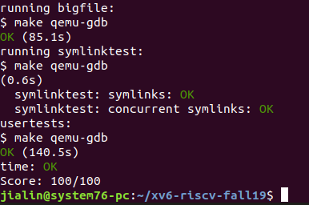

# Lab: file system
In this lab you will add large files and symbolic links to the xv6 file system. 

Before writing code, you should read "Chapter 7: File system" from the xv6 book and study the corresponding code. 

Fetch the xv6 source for the lab and check out the util branch: 

  $ git fetch 
  $ git checkout fs 
# Large files
In this assignment you'll increase the maximum size of an xv6 file. Currently xv6 files are limited to 268 blocks, or 268*BSIZE bytes (BSIZE is 1024 in xv6). This limit comes from the fact that an xv6 inode contains 12 "direct" block numbers and one "singly-indirect" block number, which refers to a block that holds up to 256 more block numbers, for a total of 12+256=268 blocks.

The bigfile command creates the longest file it can, and reports that size: 

$ bigfile 
.. 
wrote 268 blocks 
bigfile: file is too small 
$ 
The test fails because the longest file is only 268 blocks. 
You'll change the xv6 file system code to support a "doubly-indirect" block in each inode, containing 256 addresses of singly-indirect blocks, each of which can contain up to 256 addresses of data blocks. The result will be that a file will be able to consist of up to 256*256+256+11 blocks (11 instead of 12, because we will sacrifice one of the direct block numbers for the double-indirect block).

Preliminaries 
mkfs initializes the file system to have fewer than 2000 free data blocks, too few to show off the changes you'll make. Modify kernel/param.h to change FSSIZE from 2000 to 200,000:

    #define FSSIZE       200000  // size of file system in blocks 
Rebuild mkfs so that is produces a bigger disk: $ rm mkfs/mkfs fs.img; make mkfs/mkfs 

# What to Look At
The format of an on-disk inode is defined by struct dinode in fs.h. You're particularly interested in NDIRECT, NINDIRECT, MAXFILE, and the addrs[] element of struct dinode. Look at Figure 7.3 in the xv6 text for a diagram of the standard xv6 inode.
The code that finds a file's data on disk is in bmap() in fs.c. Have a look at it and make sure you understand what it's doing. bmap() is called both when reading and writing a file. When writing, bmap() allocates new blocks as needed to hold file content, as well as allocating an indirect block if needed to hold block addresses.

bmap() deals with two kinds of block numbers. The bn argument is a "logical block number" -- a block number within the file, relative to the start of the file. The block numbers in ip->addrs[], and the argument to bread(), are disk block numbers. You can view bmap() as mapping a file's logical block numbers into disk block numbers.

# Your Job
Modify bmap() so that it implements a doubly-indirect block, in addition to direct blocks and a singly-indirect block. You'll have to have only 11 direct blocks, rather than 12, to make room for your new doubly-indirect block; you're not allowed to change the size of an on-disk inode. The first 11 elements of ip->addrs[] should be direct blocks; the 12th should be a singly-indirect block (just like the current one); the 13th should be your new doubly-indirect block. You are done with this exercise when bigfile writes 65803 blocks and usertests runs successfully:
$ bigfile 
..................................................................................................................................................................................................................................................................................................................................................................................................................................................................................................................................................................................................................................................................................
wrote 65803 blocks 
done; ok 
$ usertests 
... 
ALL TESTS PASSED 
$  
bigfile will take at least a minute and a half to run. 

# Hints:

Make sure you understand bmap(). Write out a diagram of the relationships between ip->addrs[], the indirect block, the doubly-indirect block and the singly-indirect blocks it points to, and data blocks. Make sure you understand why adding a doubly-indirect block increases the maximum file size by 256*256 blocks (really -1, since you have to decrease the number of direct blocks by one).
Think about how you'll index the doubly-indirect block, and the indirect blocks it points to, with the logical block number. 
If you change the definition of NDIRECT, you'll probably have to change the declaration of addrs[] in struct inode in file.h. Make sure that struct inode and struct dinode have the same number of elements in their addrs[] arrays.
If you change the definition of NDIRECT, make sure to create a new fs.img, since mkfs uses NDIRECT to build the file system. 
If your file system gets into a bad state, perhaps by crashing, delete fs.img (do this from Unix, not xv6). make will build a new clean file system image for you.
Don't forget to brelse() each block that you bread(). 
You should allocate indirect blocks and doubly-indirect blocks only as needed, like the original bmap(). 
Make sure itrunc frees all blocks of a file, including double-indirect blocks. 
Optional challenge: support triple-indirect blocks. 

# Symbolic links
In this exercise you will add symbolic links to xv6. Symbolic links (or soft links) refer to a linked file by pathname; when a symbolic link is opened, the kernel follows the link to the referred file. Symbolic links resembles hard links, but hard links are restricted to pointing to file on the same disk, while symbolic links can cross disk devices. Although xv6 doesn't support multiple devices, implementing this system call is a good exercise to understand how pathname lookup works.

# Your job
You will implement the symlink(char *target, char *path) system call, which creates a new symbolic link at linkpath that refers to file named by target. For further information, see the man page symlink. To test, add symlinktest to the Makefile and run it. Your solution is complete when the tests produce the following output (including usertests succeeding).

$ symlinktest 

START: test symlinks 
Creating a 
Linking b -> a 
Writing to a 
Reading from b 
Removing a 
Linking a -> b 
Attempting to open b (cycle) 
Symlinking c to nonexistent file 
Creating symlink chain 1->2->3->4 
SUCCESS: test symlinks 
$ usertests 
... 
ALL TESTS PASSED 
$  
# Hints:

First, create a new system call number for symlink, add an entry to user/usys.pl, user/user.h, and implement an empty sys_symlink. 
Add a new file type (T_SYMLINK) to kernel/stat.h to represent a symbolic link. 
Add a new flag to kernel/fcntl.h, (O_NOFOLLOW), that can be used with the open system call. Note that flags passed to open are combined using a bitwise OR operator, so your new flag should not overlap with any existing flags. This will let you compile user/symlinktest.c once you add it to the Makefile.
Implement the symlink(target, path) system call to create a new symbolic link at path that refers to target. Note that target does not need to exist for the system call to succeed. You will need to choose somewhere to store the target path of a symbolic link, for example, in the inode's data blocks.
Modify the open system call to handle the case where the path refers to a symbolic link. If the file does not exist, open must fail. When a process specifies O_NOFOLLOW in the flags to open, open should open the symlink (and not follow the symbolic link).
If the linked file is also a symbolic link, you must recursively follow it until a non-link file is reached. If the links form a cycle, you must return an error code. You may approximate this by returning an error code if the depth of links reaches some threshold (e.g., 10).
Other system calls (e.g., link and unlink) must not follow symbolic links; these system calls operate on the symbolic link itself. 
You do not have to handle symbolic links to directories for this lab. 

