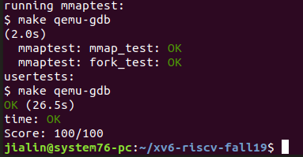

# Lab: mmap
The mmap and munmap system calls allow UNIX programs to exert detailed control over their address spaces. They can be used to share memory among processes, to map files into process address spaces, and as part of user-level page fault schemes such as the garbage-collection algorithms discussed in lecture. In this lab you'll add mmap and munmap to xv6, focusing on memory-mapped files.
Fetch the xv6 source for the lab and check out the mmap branch:  

  $ git fetch  
  $ git checkout mmap  
The manual page (run man 2 mmap) shows this declaration for mmap:  

void *mmap(void *addr, size_t length, int prot, int flags,
           int fd, off_t offset);
mmap can be called in many ways, but this lab requires only a subset of its features relevant to memory-mapping a file. You can assume that addr will always be zero, meaning that the kernel should decide the virtual address at which to map the file. mmap returns that address, or 0xffffffffffffffff if it fails. length is the number of bytes to map; it might not be the same as the file's length. prot indicates whether the memory should be mapped readable, writeable, and/or executable; you can assume that prot is PROT_READ or PROT_WRITE or both. flags will be either MAP_SHARED, meaning that modifications to the mapped memory should be written back to the file, or MAP_PRIVATE, meaning that they should not. You don't have to implement any other bits in flags. fd is the open file descriptor of the file to map. You can assume offset is zero (it's the starting point in the file at which to map).

It's OK if processes that map the same MAP_SHARED file do not share physical pages.  

munmap(addr, length) should remove mmap mappings in the indicated address range. If the process has modified the memory and has it mapped MAP_SHARED, the modifications should first be written to the file. An munmap call might cover only a portion of an mmap-ed region, but you can assume that it will either unmap at the start, or at the end, or the whole region (but not punch a hole in the middle of a region).

More generally, you should implement enough mmap and munmap functionality to make the mmaptest test program work. If mmaptest doesn't use a mmap feature, you don't need to implement that feature.  

When you're done, you should see this output:  

$ mmaptest  
mmap_test starting  
mmap_test OK  
fork_test starting  
fork_test OK  
mmaptest: all tests succeeded  
$   
$ usertests  
usertests starting  
test reparent2: OK  
...  
test bigdir: OK  
ALL TESTS PASSED  
$   
# Here are some hints:

Start by adding mmap and munmap system calls and associated flags (PROT_READ etc), in order to get user/mmaptest.c to compile. For now, just return errors from mmap and munmap. Run mmaptest, which will fail at the first mmap call.  
Fill in the page table lazily, in response to page faults. That is, mmap should not allocate physical memory or read the file. Instead, do that in page fault handling code in (or called by) usertrap, as in the lazy page allocation lab. The reason to be lazy is to ensure that mmap of a large file is fast, and that mmap of a file larger than physical memory is possible.  
Keep track of what mmap has mapped for each process. Define a structure corresponding to the VMA (virtual memory area) described in Lecture 15, recording the address, length, permissions, file, etc. for a virtual memory range created by mmap. Since the xv6 kernel doesn't have a memory allocator in the kernel, it's OK to declare a fixed-size array of VMAs and allocate from that array as needed.  
Implement mmap: find an unused region in the process's address space in which to map the file, and add a VMA to the process's table of mapped regions. The VMA should contain a pointer to a struct file for the file being mapped; mmap should increase the file's reference count so that the structure doesn't disappear when the file is closed (hint: see filedup). Run mmaptest: the first mmap should succeed, but the first access to the mmap-ed memory will cause a page fault and kill mmaptest.  
Add code to cause a page-fault in a mmap-ed region to allocate a page of physical memory, read 4096 bytes of the relevant file into that page, and map it into the user address space. Read the file with readi, which takes an offset argument at which to read in the file (but you will have to lock/unlock the inode passed to readi). Don't forget to set the permissions correctly on the page. Run mmaptest; it should get to the first munmap.  
Implement munmap: find the VMA for the address range and unmap the specified pages (hint: use uvmunmap). If munmap removes all pages of a previous mmap, it should decrement the reference count of the corresponding struct file. If an unmapped page has been modified and the file is mapped MAP_SHARED, write the page back to the file. Look at filewrite for inspiration.  
Ideally your implementation would only write back MAP_SHARED pages that the program actually modified. The dirty bit (D) in the RISC-V PTE indicates whether a page has been written. However, mmaptest does not check that non-dirty pages are not written back; thus you can get away with writing pages back without looking at D bits.  
Modify exit to unmap the process's mapped regions as if munmap had been called. Run mmaptest; mmap_test should pass, but probably not fork_test.  
Modify fork to ensure that the child has the same mapped regions as the parent. Don't forget to increment the reference count for a VMA's struct file. In the page fault handler of the child, it is OK to allocate a new physical page instead of sharing a page with the parent. The latter would be cooler, but it would require more implementation work. Run mmaptest; it should pass both mmap_test and fork_test.  
Run usertests to make sure everything still works.  

